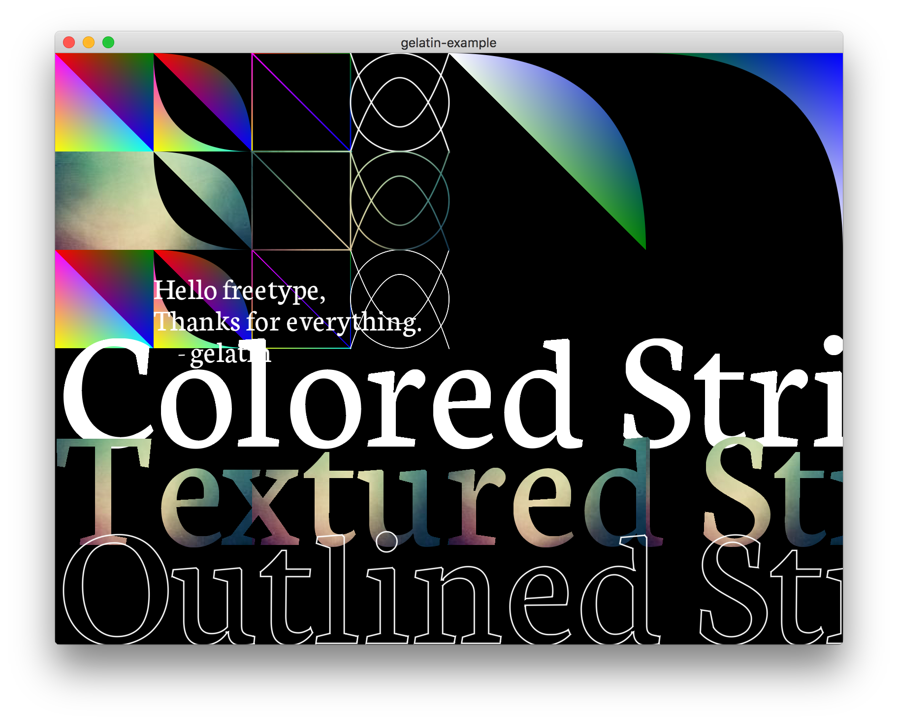

gelatin
=======

This is a mega-repo for a real-time graphics renderer in Haskell.

libraries
---------

### [gelatin (core)](https://github.com/schell/gelatin/tree/master/gelatin)
* Backend definitions
* Primitives for drawing 
 * triangles 
 * triangle strips
 * triangle fans
 * beziers (fill below curve) + inverted beziers (fill above curve) 
 * thick, feathered stroked lines and for creating new backends. 
* Definitions and functions for post compilation affine transformation, 
  color multiply, red channel replacement (for font textures) 

### [gelatin-gl](https://github.com/schell/gelatin/tree/master/gelatin-gl)
* Backend for compiling `gelatin` pictures using OpenGL. 

### [gelatin-freetype2](https://github.com/schell/gelatin/tree/master/gelatin-freetype2)
* freetype2 text with character atlas and word map.

### [gelatin-fruity](https://github.com/schell/gelatin/tree/master/gelatin-fruity)
* Functions for extracting truetype font geometry as `gelatin` primitives. 

### [gelatin-sdl2](https://github.com/schell/gelatin/tree/master/gelatin-sdl2)
* SDL2 initialization and windowing. 

### [gelatin-webgl](https://github.com/schell/gelatin/tree/master/gelatin-webgl)
* WebGL backend via ghcjs (experimental) 

examples
--------
For examples please see 
[gelatin-example](https://github.com/schell/gelatin/tree/master/gelatin-example)
and 
[odin](https://github.com/schell/odin)

install
-------
`gelatin` depends on

* [sdl2](http://libsdl.org)
* [freetype2](https://www.freetype.org/index.html)

You can install them with the following platform specific steps.

### Mac OS X

Using [homebrew](https://brew.sh/)...

    brew install freetype
    brew install sdl2

### Ubuntu
First install freetype2

    apt-get install libfreetype6

The [sdl2 bindings](https://github.com/haskell-game/sdl2) require an sdl2
install >= 2.0.4, or for special instructions to be followed. Assuming you're
on `Ubuntu >= 16.04`, you can simply run

    apt-get install libsdl2-dev

otherwise please visit the link above and install via their README.

### Windows 10 with MSYS2/MINGW

    pacman -S mingw-w64-x86_64-pkg-config mingw-w64-x86_64-freetype mingw-w64-x86_64-SDL2

building source
---------------
The easiest way to get up and running on the Haskell toolchain is to download
[stack](https://docs.haskellstack.org/en/stable/README/). All of gelatin's projects
are spec'd out with stack.yaml build files, so picking the correct versions of
libraries is not needed if you follow the stack path.

    git clone https://github.com/schell/gelatin.git

    cd gelatin

If you just installed stack, run

    stack setup

Go make some ☕ and then...

    stack build
    
Note on Windows that if you run into [this error](https://github.com/commercialhaskell/stack/issues/3492)

    ghc-pkg.EXE: C:\sr\snapshots\3c4ad812\pkgdb\package.cache: you don't have
    permission to modify this file
    
You can simply run `stack build` over and over until the thing finally compiles.
_facepalm_ - this will be fixed with ghc 8.2.

Drink your ☕, take a walk and rejoice...

contributions
-------------
I welcome any and all contributions. Feel free to [tackle an issue (or a TODO)](https://github.com/schell/gelatin/issues) by making a pull request! 

If you'd like to make a donation you can do so [through patreon](https://www.patreon.com/schell). 

This library will always be free.
